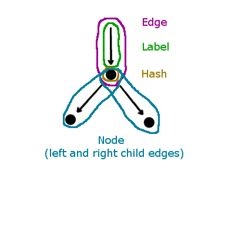
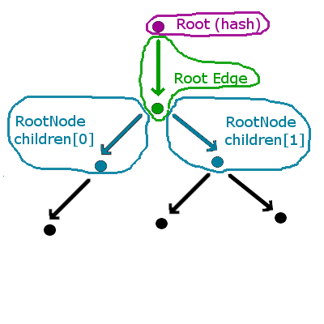
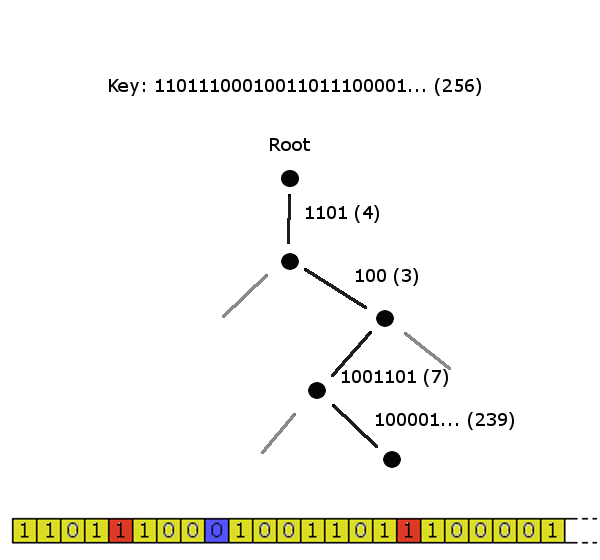

# PatriciaTree

**Package:** patricia_tree

**Contract type:** contract

**Source file:** [PatriciaTree.sol](../../src/patricia_tree/PatriciaTree.sol)

**Example usage:** [PatriciaTreeExamples.sol](../../examples/patricia_tree/PatriciaTreeExamples.sol)

**Tests source file:** [patricia_tree.sol](../../test/patricia_tree/patricia_tree.sol)

**Perf (gas usage) source file:** [patricia_tree.sol](../../perf/patricia_tree/patricia_tree.sol)

## Description

PatriciaTree.sol is an implementation of a Patricia tree in Solidity, made by Christian Reitwiessner. You can insert keys and values into it, as well as getting and validating merkle proofs.

A visualization tool can be found at: https://androlo.github.io/spte-dapp/index.html. Note that it requires you to accept unsafe script, since it uses http (only calls local eth client) but github enforces https by default.

### Overview

This is an overview of the patricia tree.
A more technical writeup (although still very much a WIP) can be found in Christian's own repo: https://github.com/chriseth/patricia-trie

The tree is made up of three main data-types, which can all be found in `Data.sol`:

##### Label

A label contains:

`data` : `bytes32`

`length` : `uint` between `0` and `256` (inclusive)

The value of the label is the `length` most significant bits of `data`. Additionally, `data` is usually formatted so that any additional bits are set to 0.

The `null` label is the label where both `data` and `length` is `0`.

##### Edge

An Edge contains:

`label` : `Label`

`node` : `bytes32`

The `node` field is the hash of a `node`.

The `null` edge is the edge where `label` is the null `Label`, and `hash` is `0`.

An edge is essentially a node (hash) coupled with the edge that leads to it.

##### Node

A Node contains:

`children` : `Edge[2]`

The children are edges leading **out** of the node, and into the next node (i.e. `Edge.node`). Each node can have up to two children.

The `null` node is the node where both `children[0]` and `children[1]` is the null `Edge`

#### Tree

The tree is a Merkle-tree of radix 2, which is also known as a Merkle-Patricia trie. It contains the following:

`root` : `bytes32`

`rootEdge` : `Edge`

`nodes` : `mapping(bytes32 => Node)`

##### root and rootEdge

`rootEdge` is the top-most edge of the tree.

`root` is the root hash of the `rootEdge`, and thus the entire tree. `root` and `rootEdge` always exists, although in an empty tree they will both be null.

`root` can be seen as a special type of `Node` that only has one child (edge); namely `rootEdge`.

With this in mind, the actual root node would be `root`, and its child would be `rootEdge`. Additionally, `root` does not have an edge leading into it, and is thus not part of an edge itself.

#### Keys and Values

Keys and values are both provided in the form of `bytes`. Before being inserted into the tree they are both hashed using `keccak256`.

Keys are encoded as paths in the trie. Part of them are bit-strings stored in edge labels, and part of them are embedded into the structure of the tree itself. More on this later.

#### Insertion

The actual algorithm for adding in new key-value pairs can be found in the contract itself.

The diagram below shows how a key could be encoded.

- We start out with a key hash `Label`, where `label.data` is the full hash, and `label.length` is `256`.
- The first `4` most significant bits are shared with the label in `rootEdge`, which means they are removed. `label.length` is now `252`.
- Shave of the most significant bit. It is `1`, so we go right. `label.length` is now `251`.
- The first `3` most significant bits are shared with the next label, which means they are removed. `label.length` is now `248`.
- Shave of the most significant bit. It is `0`, so we go left. `label.length` is now `247`.
- The first `7` most significant bits are shared with the next label, which means they are removed. `label.length` is now `240`.
- Shave of the most significant bit. It is `1`, so we go right. `label.length` is now `239`.
- There is no edge going right, so we have to add one. The label will contain whats left of the key-hash as `data`, have `length` `239`, and the `node` value will be the hash of the value provided. The node itself becomes a new leaf node.

#### Merkle-proofs

Merkle proofs can be gotten by calling the `getProof` function with a `key` as argument. If the key exists in the trie, it will return a `branch mask`, which is a "roadmap" to the terminal node. To be more precise, it will return a bit-string where a set bit at position `p` means that the bit at position `p` in the key-hash represents branch selection (i.e. jumping to one of the children of the current node). This as opposed to unset bits which are contained in edge labels.

The function will also return a set of `siblings`, which are hashes of sibling edges (at each branching point). These are needed in order to verify the merkle-proof, as it is based on combining the hashes of both children at each node.

To validate a merkle-proof, you call the `validateProof` function and pass in the previously mentioned `branch mask` and `siblings`, along with the `key`, `value`, and the root hash against which the proof is to be validated.